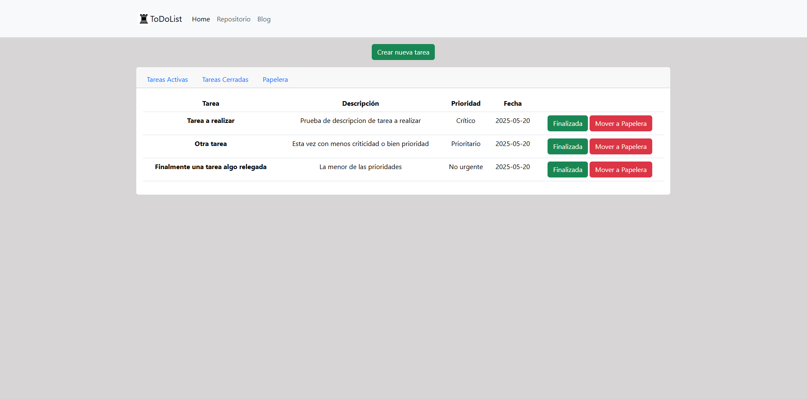

# ⚙️ Py-Lab-WS-02-ToDoList ⚙️

This project, is the second one of a series of repositories that consists on different kind of exercises to practice certain points of web development with Python.
The idea of this particular repository, is to build a 'to do list'.
This exercise consist on working on a 'CRUD' application, which also, has a connection with a DataBase (in this case, SQLite) in order to save user's logs (tasks in this case)

---

As a personal note, this exercise gave me the skill of connecting to a DataBase, and improving my management of URL's and code in general.

---

## ⚙️ Status

Live Version!: https://marsu-todolist.onrender.com/
Pending: User authentication
